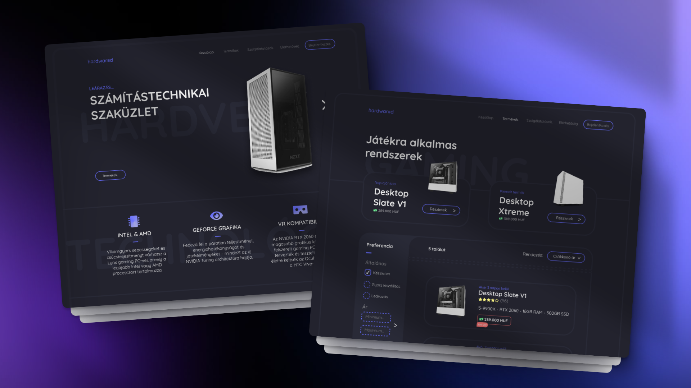

# Hardwared - An NZXT Rebranded Webshop

## About the App

Hardwared is a fully functioning custom webshop created as a rebrand for NZXT. The backend is built with **Django Rest Framework**, serving a **React** frontend. This was my first React application, which I built to learn the basics of React and to practice integrating it with any kind of REST API endpoints.

## Tech Stack

- 🐍 **Django Rest Framework**: For the REST API backend
- ⚛️ **React**: For the interactive frontend
- 💾 **Django ORM**: For database interactions
- 🎨 **SCSS**: Custom styling for a responsive and modern look

## Features

- **JWT-Based Authentication**: Secure authentication and authorization
- **Admin CRUD Panel**: Manage products, users, and orders
- **User Profiles**: View and edit personal information, order history, and favorites
- **Fully Functioning Webshop**: Add to cart, place orders, manage favorites
- **Dynamic Product Filters**: Filter products by price, type, specifications, ratings, etc...
- **Responsive Design**: Custom SCSS used for a modern, mobile-friendly interface
